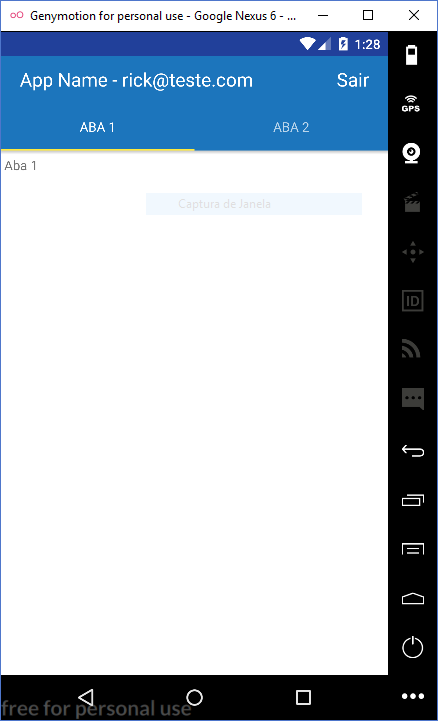

# React Native App with Firebase Sign In and Sign Up

## How to install
* Clone this repository `git clone https://github.com/RiickNogueira/app_react_native_auth_firebase.git`
* Rename directory `app_react_native_auth_firebase` to `your-app-name`
* Run `react-native init your-app-name`
* Run `cd your-app-name`
* Run `npm install`

## Important!
* Modify `config_firebase` to your firebase object config in `app.js`
* Modify `AppRegistry.registerComponent` to your app name in `index.android.js` and `index.ios.js`

## Run Android
* Run `react-native run-android`

## IOS
Not supported 

